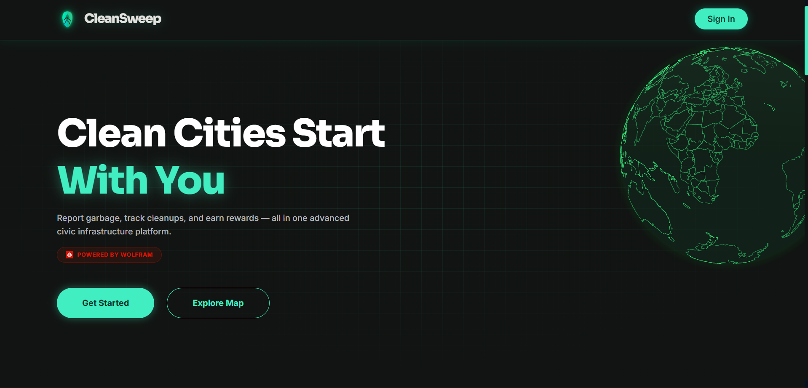

## **Problem Statement**

**Theme:** Social Impact

**Problem statement (AI for Social Impact):** 
> *Civic waste management relies heavily on manual reporting and inefficient collection routes, leading to unverified garbage dumping and overflowing municipal dustbins. Furthermore, citizens lack the motivation and transparency to actively participate in keeping their communities clean.*

<div align="center">
  
  <p style="margin:8px 0 0;font-size:32px;font-weight:800;">CleanSweep</p>
</div>

**CleanSweep** is an end-to-end *“AI for Social Impact”*, multi-module platform designed to be the central nervous system for a city's waste management.
It transforms civic waste reporting from a manual, unverified chore into a gamified, data-driven ecosystem. 

It serves as a civic waste management platform that empowers citizens to report garbage, track cleanups, earn rewards, and build cleaner communities — all in one app.

> **Powered by Wolfram** 
> This project leverages Wolfram Machine Learning to automatically classify and verify images of waste, ensuring accurate and efficient civic reporting.


## Demo Link
<div align = "center">

</div>

---

## ✨ Features

- 📍 **Report Garbage** — Submit waste reports with photo, location pin, severity, and an optional note
- 🗺️ **Explore Map** — Browse all reports on an interactive map with status filters
- 🏘️ **Community Feed** — See what others are reporting, like posts, and join discussions
- 🏆 **Points & Leaderboard** — Earn points for logging in, reporting waste, and confirming cleanups
- 🛍️ **Marketplace** — Redeem points for rewards and offers. *(Rewards are funded through municipal partnerships, local business sponsorships, and CSR initiatives aimed at community cleanliness).*
- 👤 **User Profile** — View your stats, report history, and earned badges
- 🛠️ **Admin Dashboard** — Municipal staff can manage reports and update dustbin statuses

---

## 🛠️ Tech Stack

| Layer | Technology |
|---|---|
| Frontend | React 19 + Vite |
| AI / ML | Wolfram (Cloud API) |
| Styling | Vanilla CSS (Glassmorphism dark theme) |
| Backend | Supabase (Auth, Database, Storage) |
| Maps | Leaflet.js |
| State | Zustand |
| Routing | React Router v7 |

---

## 🚀 Getting Started

### Prerequisites
- Node.js 18+
- A [Supabase](https://supabase.com) project

### Installation

```bash
# Clone the repo
git clone https://github.com/githubutsav/CleanSweepV1.git
cd CleanSweepV1

# Install dependencies
npm install
```

### Environment Setup

Create a `.env` file in the root with your credentials:

```env
VITE_SUPABASE_URL=your_supabase_project_url
VITE_SUPABASE_ANON_KEY=your_supabase_anon_key
VITE_WOLFRAM_API_URL=your_wolfram_classify_api_url
VITE_WOLFRAM_ROUTE_API_URL=your_wolfram_route_api_url
```

### Run Locally

```bash
npm run dev
```

Open [http://localhost:5173](http://localhost:5173) in your browser.

---

## 📁 Project Structure

```
src/
├── pages/
│   ├── Home.jsx          # Main app (report, map, community, leaderboard)
│   ├── Login.jsx         # Auth page
│   ├── Profile.jsx       # User profile & stats
│   ├── Marketplace.jsx   # Points redemption store
│   └── Admin.jsx         # Municipal admin panel + Route Optimizer
├── lib/
│   ├── supabaseClient.js # Supabase instance
│   └── store.js          # Zustand global state
└── index.css             # Global styles & design tokens

wolfram/
├── classify_waste.wl     # AI image classification (ImageIdentify)
├── optimize_route.wl     # TSP route optimization (FindShortestTour)
└── README.md             # Wolfram deployment instructions
```

---

## 🗃️ Database

The app uses Supabase with the following core tables:

- `profiles` — User info, points, and stats
- `garbage_reports` — Citizen-submitted waste reports
- `dustbin_status` — Municipal dustbin tracking
- `community_posts` — Community feed posts
- `post_likes` / `post_comments` — Engagement on posts
- `leaderboard` — Top contributors view

> **Note:** SQL setup scripts are located in the `database/` directory. Run `database/setup.sql` in your Supabase SQL editor to create the necessary tables and policies.

---

##  Wolfram Integration

CleanSweep uses **Wolfram** as its computational intelligence layer, deployed as REST APIs on Wolfram Cloud.

### AI Waste Classification (`classify_waste.wl`)

When a citizen photographs waste, the image is sent to a Wolfram Cloud API that uses **neural networks and Wolfram's Knowledge Base** to return rich structured data:

| Property | Wolfram Function | Example |
|---|---|---|
| Category | `ImageIdentify` | "Plastic" |
| Severity | Custom `Classify` | "High" (score 3/5) |
| Recyclable | Knowledge Base lookup | ♻️ Yes |
| Decomposition | `EntityValue` | "450 years" |

> **Scalability Note & Fallback:** To ensure high availability and robust performance, CleanSweep is designed to fallback to vision models like **Google Gemini** if the Wolfram Cloud API encounters rate limits or image processing timeouts.

```wolfram
(* Core classification logic *)
identified = ImageIdentify[#image, All, 3];
category = categorizeWaste[First[Keys[identified]]];
severity = assessSeverity[category];
```

### Route Optimization (`optimize_route.wl`)

Municipal admins can compute the **optimal garbage truck route** across all pending reports using Wolfram's **Travelling Salesman Problem solver**:

> **Scalability Note & Fallback:** While Wolfram Cloud handles moderate datasets elegantly, computing Traveling Salesman tours at a massive city scale may encounter execution timeouts or rate limits. As a fallback for enterprise deployment, CleanSweep's routing architecture is designed to integrate seamlessly with dedicated routing engines like **Leaflet Routing Machine** or Google OR-Tools.

```wolfram
(* Solve TSP across all report GPS coordinates *)
geoPoints = GeoPosition[{#["lat"], #["lon"]}] & /@ parsed;
tour = FindShortestTour[geoPoints];
totalDistance = Total[Table[
  GeoDistance[geoPoints[[tour[[2,i]]]], geoPoints[[tour[[2,i+1]]]]],
  {i, Length[tour[[2]]] - 1}
]];
```

### Architecture

```
┌─────────────┐     POST image     ┌──────────────────────┐
│  React App  │ ─────────────────→ │  Wolfram Cloud API   │
│  (Home.jsx) │ ←───────────────── │  classify_waste.wl   │
│             │     JSON response   │  • ImageIdentify     │
└─────────────┘                     └──────────────────────┘

┌─────────────┐   POST coordinates  ┌──────────────────────┐
│  React App  │ ─────────────────→  │  Wolfram Cloud API   │
│ (Admin.jsx) │ ←─────────────────  │  optimize_route.wl   │
│             │   Optimal ordering   │  • FindShortestTour  │
└─────────────┘                      └──────────────────────┘
```

> See [`wolfram/README.md`](wolfram/README.md) for full deployment instructions.


---

## 📸 Screenshot



---

## 📄 License

MIT © [githubutsav](https://github.com/githubutsav)

## 👥 Team Code Oxide

| Name | GitHub |
|------|--------|
| Tushar Bajpai | [@Tushar](https://github.com/Tushar-Bajpai) |
| Sankalp Saini | [@Sankalp](https://github.com/Arikalp) |
| Utsav Singh | [@Utsav](https://github.com/githubutsav) |

---

<div align="center">
  Built with ❤️ by Team Code Oxide
</div>
